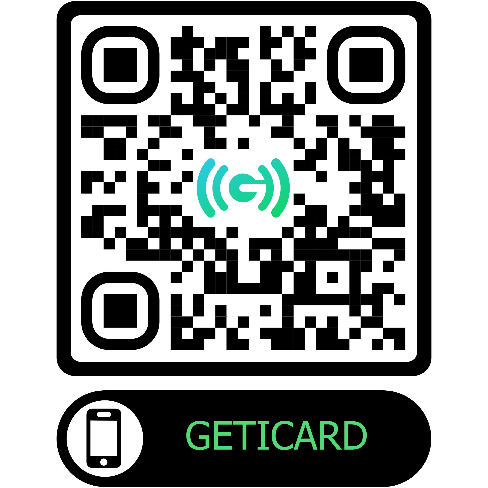
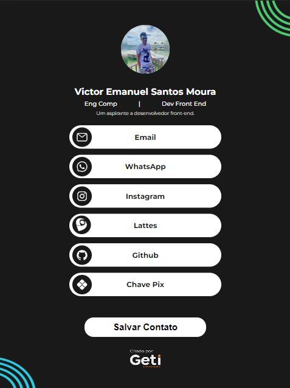

# Projeto GetiCard

Codigos referentes ao projeto GETICARD, um cartão virtual de identificação.

## Descrição

Este projeto é uma aplicação web desenvolvida em ReactJS que utiliza SCSS como pré-processador de estilos e Axios para fazer requisições HTTP a APIs externas.

Além disso, o projeto está hospedado na AWS Amplify, uma plataforma de hospedagem e CI/CD (Continuous Integration/Continuous Deployment) para aplicativos da web.

Para visualizar o projeto já hospedado, [clique aqui.](https://main.d2mzphd0dypmws.amplifyapp.com)

### Requisitos

Certifique-se de ter as seguintes dependências instaladas em sua máquina antes de executar o projeto:

- [Node.js](https://nodejs.org)
- [Yarn (opcional)](https://yarnpkg.com)

### Configuração

Siga as etapas abaixo para configurar e executar o projeto localmente:

1. Clone este repositório em sua máquina:

```bash
git clone https://github.com/VictorEmanuel08/projeto-geticard.git
```

2. Navegue até o diretório do projeto:

```bash
cd projeto-geticard
```

3. Instale as dependências do projeto:

```bash
npm install
# ou
yarn install
```

4. Inicie o servidor de desenvolvimento:

```bash
npm start
# ou
yarn start
```

Após executar esses comandos, o projeto estará acessível em `http://localhost:3000` no seu navegador.

## Hospedagem na AWS Amplify

Este projeto está hospedado na AWS Amplify. Ao fazer um push para o repositório no Git, a AWS Amplify configurará automaticamente o pipeline de CI/CD e implantará a versão mais recente do aplicativo.

Para visualizar a configuração da hospedagem na AWS Amplify, entre em contato comigo por [e-mail](mailto:victorem3181@gmail.com) ou <a href="https://api.whatsapp.com/send?phone=+5598992303667&text=Olá. Vim pelo seu github.">WhatsApp</a>

## Criação dos QR-Codes

Os QR-Codes foram criados no
<a href="https://me-qr.com">me-qr</a>, um gerador gratuito de QR-Code que permite ainda a sua estilização.

<table>
  <tr>
    <td align="center" width="50%">
      <p>Meu QR-Code de exemplo</p>
      
    </td>
    <td align="center" width="50%">
      <p>Meu GetiCard:</p>
      
    </td>
  </tr>
</table>


Você também pode acessá-lo clicando
<a href="https://main.d2mzphd0dypmws.amplifyapp.com/card-view/victor">
aqui.</a>

## Contribuindo

Se você quiser contribuir para este projeto, fique à vontade para abrir uma solicitação pull. Sinta-se livre para discutir e melhorar o projeto em equipe!
